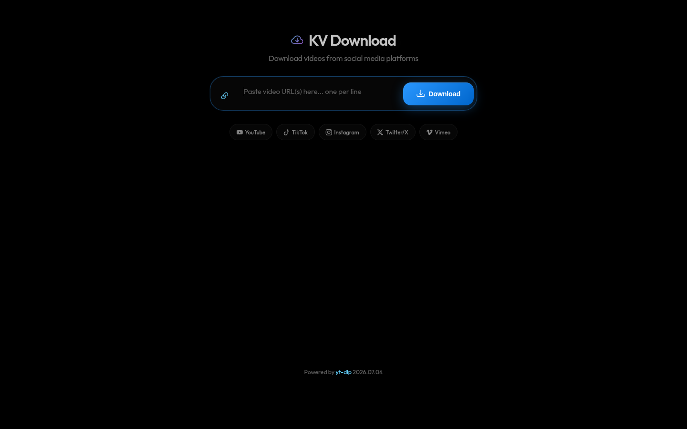

<div align="center">

# 🎬 KV Download

**A fast, mobile-friendly video downloader for social media platforms.**

Built with **Go** + **[yt-dlp](https://github.com/yt-dlp/yt-dlp)** — deploy anywhere in one command.

[](https://go.dev/)
[](https://hub.docker.com/repositories/vndangkhoa)
[](LICENSE)
[](#docker)

</div>

<div align="center">
  
</div>

<br>

## 📦 Table of Contents

- [✨ Features](#-features)
- [🚀 Quick Start](#-quick-start)
- [🐳 Docker](#-docker)
  - [Docker Hub](#docker-hub)
  - [Forgejo Registry](#forgejo-registry)
  - [Docker Compose](#docker-compose)
  - [Build Locally](#build-locally)
  - [Synology NAS](#synology-nas)
- [🍪 Cookies (optional)](#-cookies-optional)
- [⚙️ Configuration](#️-configuration)
- [📡 API](#-api)
- [🗂️ File Structure](#️-file-structure)
- [📄 License](#-license)

---

## ✨ Features

| 🚀 Multi-URL | 📥 Download queue | 💾 ZIP export |
|:---:|:---:|:---:|
| Paste multiple links, download them all in sequence | Real-time per-URL status with progress bar | Bundle all videos into a single download |

| 📱 Responsive | 👀 Video preview | 🔄 Auto-update |
|:---:|:---:|:---:|
| Works on desktop, tablet, and mobile | Watch before you save | yt-dlp refreshes itself every 6 hours |

| 🌙 Dark mode | 🔒 Cookie support | 🐳 One-command deploy |
|:---:|:---:|:---:|
| Sleek glassmorphism UI | Authenticate with TikTok, Instagram, Twitter/X | Single Docker image for amd64 & arm64 |

### Supported platforms

YouTube · TikTok · Instagram · Twitter/X · Vimeo · Reddit · [many more](https://github.com/yt-dlp/yt-dlp/blob/master/supportedsites.md)

---

## 🚀 Quick Start

**Prerequisites:** [Go](https://go.dev/dl/), [yt-dlp](https://github.com/yt-dlp/yt-dlp#installation), [FFmpeg](https://ffmpeg.org/download.html)

```bash
git clone https://github.com/vndangkhoa/kv-download.git
cd kv-download
./run.sh
```

Then open **http://localhost:9292** 🎉

---

## 🐳 Docker

### Docker Hub

```bash
docker pull vndangkhoa/kv-download:latest
docker run -d -p 9292:9292 \
  -v ./downloads:/download \
  vndangkhoa/kv-download:latest
```

### Forgejo Registry

```bash
docker pull git.khoavo.myds.me/vndangkhoa/kv-download:latest
docker run -d -p 9292:9292 \
  -v ./downloads:/download \
  git.khoavo.myds.me/vndangkhoa/kv-download:latest
```

### Docker Compose

```yaml
services:
  kv-download:
    image: vndangkhoa/kv-download:latest
    container_name: kv-download
    restart: unless-stopped
    ports:
      - "9292:9292"
    volumes:
      - ./downloads:/download
    environment:
      - TZ=Asia/Ho_Chi_Minh
```

```bash
docker compose up -d
```

### Build Locally

```bash
./docker-build.sh
./docker-run.sh
```

### Synology NAS

1. Open **Container Manager** (or **Docker** on older DSM)
2. Create a new project/stack:

```yaml
services:
  kv-download:
    image: vndangkhoa/kv-download:latest
    container_name: kv-download
    restart: unless-stopped
    ports:
      - "9292:9292"
    volumes:
      - /volume2/docker/kv-download/downloads:/download
      - /volume2/docker/kv-download/cookies.txt:/app/cookies.txt
    environment:
      - TZ=Asia/Ho_Chi_Minh
```

3. Place `cookies.txt` in `/volume2/docker/kv-download/`
4. Access at `http://NAS_IP:9292`

#### 🧹 Clean up downloads

```bash
# SSH into NAS, then delete all downloaded files
rm -rf /volume2/docker/kv-download/downloads/*

# Or delete files older than 7 days
find /volume2/docker/kv-download/downloads/ -type f -mtime +7 -delete
```

Automate cleanup via **Task Scheduler** in DSM:

```bash
# Run daily at 3 AM, delete files older than 7 days
0 3 * * * find /volume2/docker/kv-download/downloads/ -type f -mtime +7 -delete
```

---

## 🍪 Cookies (optional)

Some platforms (**TikTok**, **Instagram**, **Twitter/X**) require authentication to download private or age-restricted content. Create a `cookies.txt` in Netscape format:

### Option 1: Browser extension

1. Install [Get cookies.txt LOCALLY](https://chromewebstore.google.com/detail/get-cookiestxt-locally/cclelndahbckbenkjhflpdbgdldlbecc) (Chrome) or [cookies.txt](https://addons.mozilla.org/en-US/firefox/addon/cookies-txt/) (Firefox)
2. Log in to the platform (TikTok, Instagram, etc.)
3. Click the extension icon and export as `cookies.txt`
4. Place the file in the project root (same directory as `run.sh`)

### Option 2: yt-dlp browser extraction

yt-dlp can extract cookies directly from your installed browser. **Close the browser first!**

<details>
<summary>🍎 macOS</summary>

```bash
pip3 install secretstorage

# Chrome
yt-dlp --cookies-from-browser chrome --cookies cookies.txt "https://www.youtube.com/"
# Safari
yt-dlp --cookies-from-browser safari --cookies cookies.txt "https://www.youtube.com/"
# Firefox
yt-dlp --cookies-from-browser firefox --cookies cookies.txt "https://www.youtube.com/"
```
</details>

<details>
<summary>🐧 Linux</summary>

```bash
# Ubuntu/Debian
sudo apt install python3-secretstorage

# Chrome
yt-dlp --cookies-from-browser chrome --cookies cookies.txt "https://www.youtube.com/"
# Firefox
yt-dlp --cookies-from-browser firefox --cookies cookies.txt "https://www.youtube.com/"
```
</details>

<details>
<summary>🪟 Windows</summary>

```cmd
pip install secretstorage
yt-dlp --cookies-from-browser chrome --cookies cookies.txt "https://www.youtube.com/"
yt-dlp --cookies-from-browser firefox --cookies cookies.txt "https://www.youtube.com/"
```
</details>

> ⚠️ **Note:** The browser must be fully closed (not running in background) when extracting cookies.

### Using cookies.txt

**Local:**
```bash
# Place cookies.txt in the project root — run.sh passes it automatically
./run.sh
```

**Docker:**
```bash
docker run -d -p 9292:9292 \
  -v ./downloads:/download \
  -v ./cookies.txt:/app/cookies.txt \
  vndangkhoa/kv-download:latest
```

**Docker Compose:**
```yaml
services:
  kv-download:
    image: vndangkhoa/kv-download:latest
    container_name: kv-download
    restart: unless-stopped
    ports:
      - "9292:9292"
    volumes:
      - ./downloads:/download
      - ./cookies.txt:/app/cookies.txt
    environment:
      - TZ=Asia/Ho_Chi_Minh
```

> 🔒 **Security:** `cookies.txt` contains session tokens. **Never commit it to git or share it publicly.**
>
> ⚠️ **Note:** `cookies.txt` must be **writable** (don't mount it with `:ro`) — yt-dlp saves cookies back to the file on exit. If it's read-only, downloads will fail with an error.

---

## ⚙️ Configuration

| Variable | Description | Default |
|---|---|---|
| `MR_DOWNLOAD_DIR` | Directory where videos are saved | `/download` (Docker) / `downloads/` (local) |
| `MR_PROXY` | Proxy URL passed to yt-dlp via `--proxy` | _(empty)_ |

---

## 📡 API

### Get video info (JSON)

```
GET /api/info?url=VIDEO_URL
```

**Returns:**

```json
{
  "media": [
    {
      "Id": "abc123/video.mp4",
      "Name": "video.mp4",
      "SizeInBytes": 1048576,
      "HumanSize": "1.0 MB"
    }
  ],
  "error": ""
}
```

### Download a video

```
GET /download?id=VIDEO_ID
```

Streams the video file directly.

### Download all as ZIP

```
GET /download/zip?id=ID1&id=ID2&id=ID3
```

Bundles multiple videos into a single `.zip` file.

### Bookmarklet

Drag this to your bookmarks bar for one-click downloads from any page:

```
javascript:(location.href="http://127.0.0.1:9292/fetch?url="+encodeURIComponent(location.href));
```

---

## 🗂️ File Structure

```
<download-dir>/
├── <hash>/
│   ├── <video-id>.mp4
│   └── <video-id>.mp4
└── json/
    └── <video-id>.info.json
```

---

## 📄 License

[MIT](LICENSE)

---

<div align="center">
  <sub>Made with ❤️ by <a href="https://github.com/vndangkhoa">vndangkhoa</a> · Star it on <a href="https://github.com/vndangkhoa/kv-download">GitHub</a> ⭐</sub>
</div>